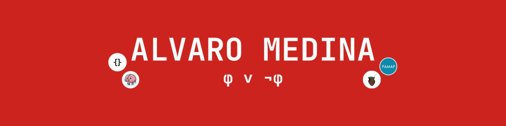

<h2>🙋🏽‍♂️ Sobre mí</h2>
<ul style="list-style-type: none; padding-left: 0;">
 <li>🥳 Tengo 21 años</li>
 <li>🤓 Estudiante de Ciencias de la Computación</li>
 <li>📖 Actualmente en 3er año en la universidad</li>
 <li>🌵 Nacido en Jujuy, Argentina ✨🇦🇷 </li>
 <li>📌 Viviendo en Córdoba, Argentina ✨🇦🇷 </li>
</ul>

<h2>🌐 Social</h2>

  
  
  
  
  
  

## 🧠 Lenguajes

## 💻 Frameworks y Librerías

## ⚒️ Herramientas

<h2>🚀 Algunos Proyectos</h2>

